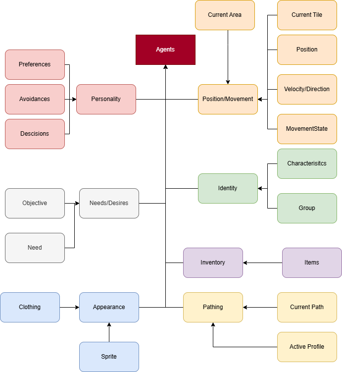

# Architecture Diagrams

## Game Engine

### Math
**Vec2** - The standard vector use in the game used as a float e.g. for agent positions  
**Vec2i** - The integer verrsion used for example tile positions  
**MathUtils** - Contains helpful maths functions to be used  
### Asset Manager
**Asset Manager** - Stores all basic assets, making it available to all systems, responsivble for the asset load order   
**Texture Loader** - Loads all the Textures  
**Audio Loader** - Loads all the Audio in audio clips  
**Font Loader** - Loads all the fonts  
### Interfaces
**ILoader** - All data that needs to be loaded requires this  
**ISaver** -  All data that needs to be saved requires this  
**IRenderable** -  All objects that need to be rendered requires this  
**IUpdatable** -  All objects that need to be updated requires this  
**IInitialisable** -  All objects that need to be initailised requires this  
### Input
**Keyboard** - Handles Keyobard input data that can be accessed , also fires events  
**Mouse** - Handles Mouse input data that cna be accessed, also fires events  
### Threads
**Thread Pool** - Store the worker pool and cnaq assign concurrent tasks  
**SnapShot** - Stores and Savees versions of data, with a readble and writable versions that safely switch  
**BackgroundWorker** - Runs specifc utillity fucnitons for games , not part of the main thread pool  
### Core
**App** - the template for an app uincluding update, init  
**Timer** - Responsible for delta time  
## UI

## Map

## Pathing

## Agents

